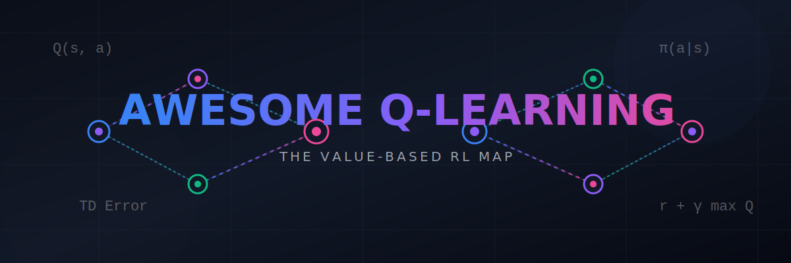
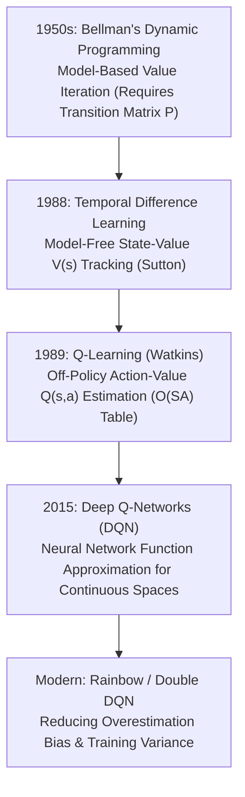

# Awesome-Q-Learning 🤖✨

<meta name="description" content="A comprehensive reference guide for Q-Learning, mapping its mathematical formulation, evolutionary lineage, operational execution, and modern Deep Q-Network (DQN) extensions." />
<meta name="keywords" content="Q-Learning, Reinforcement Learning, RL, Deep Q-Network, DQN, Bellman Equation, Machine Learning, AI" />

<p align="center">
  
</p>

<p align="center">
  <a href="https://github.com/ishandutta2007/Awesome-Awesome-Awesome"></a><a href="https://discord.gg/jc4xtF58Ve"></a> <a href="https://github.com/ishandutta2007/Awesome-Q-Learning"></a> <a href="https://github.com/ishandutta2007/Awesome-Q-Learning/blob/main/LICENSE"></a>
</p>


## 🪙 The Q-Learning & Value-Based RL Map 🗺️

> **A comprehensive reference guide for Q-Learning—mapping its mathematical formulation, evolutionary lineage from classical dynamic programming, operational execution, and modern Deep Q-Network (DQN) extensions.** 🚀

Q-Learning revolutionized reinforcement learning by introducing a model-free, off-policy framework to learn optimal action-value functions. This single innovation bridged the gap between rigid, environment-dependent dynamic programming and model-agnostic autonomous control.

---

## 📅 The Evolutionary Timeline 🧬

The architectural shift from full environmental awareness to sample-driven, model-free temporal difference learning.



---

## 🧭 Deep Dive: From Precursors to Q-Learning 🔍

### 1. Bellman's Dynamic Programming & Value Iteration (1957) 🧠
Richard Bellman formulated the foundation of optimal control via the Markov Decision Process (MDP).
*   **The Constraint:** It is **model-based**. To calculate the optimal value function, the agent must have perfect, explicit knowledge of the environment's transition probabilities \(P(s' \mid s, a)\) and reward functions R(s, a).
*   **Limitation:** Fails in real-world scenarios where the environment's physics, rules, or transition dynamics are too complex to model mathematically (The Curse of Dimensionality).

### 2. Temporal Difference (TD) Learning (Sutton, 1988) ⏱️
Richard Sutton introduced TD learning, combining the sample-driven nature of Monte Carlo methods with the bootstrapping nature of Dynamic Programming.
*   **The Advantage:** It is **model-free**. The agent learns directly from raw experience (episodes of interactions) without needing a transition matrix. It updates estimates based on individual steps rather than waiting for the entire episode to end.
*   **Limitation:** Classic TD learning evaluates a static, fixed policy (π) and calculates the state-value function V(s). It does not directly provide an action-selection mechanism for control tasks unless paired with a model to look ahead at subsequent states.

### 3. Q-Learning (Watkins, 1989) ⚙️
Christopher Watkins solved the control loop limitation by shifting the optimization target from the state-value function V(s) to the **action-value function Q(s, a)**. 

*   **The Core Innovation:** The Q-function tracks the expected long-term return of taking a specific action a in a specific state s, and subsequently following the optimal policy.
*   **Off-Policy Nature:** Q-Learning updates its value estimates using the absolute best possible downstream action, regardless of the exploratory action the agent's current behavioral policy actually chose.

---

## 🧮 Mathematical Formulation & The Bellman Equation 📐

The core update rule for Tabular Q-Learning is driven by the **Temporal Difference (TD) Error**:

\[Q(s, a) \leftarrow Q(s, a) + \alpha \left[ \underbrace{R(s, a) + \gamma \max_{a'} Q(s', a')}_{\text{TD Target}} - Q(s, a) \right]\]

### Parameter Definitions:
*   α (Learning Rate): Controls how aggressively the model overwrites old estimates with new experience (0 < α ≤ 1).
*   R(s, a): The immediate reward received after executing action a in state s.
*   γ (Discount Factor): Determines the present value of future rewards (0 ≤ γ < 1). A value near 0 makes the agent short-sighted.
*   \(\max_{a'} Q(s', a')\): The maximum estimated future reward available from the next state s'.

---

## 🎛️ Algorithmic Execution: Tabular Q-Learning 💻

Tabular Q-Learning stores values inside a discrete matrix where rows represent states and columns represent actions.

```python
import numpy as np

def train_q_learning(env, alpha=0.1, gamma=0.99, epsilon=0.1, episodes=1000):
    # Initialize Q-table with zeros: Rows = States, Columns = Actions
    q_table = np.zeros([env.observation_space.n, env.action_space.n])
    
    for episode in range(episodes):
        state, _ = env.reset()
        done = False
        
        while not done:
            # 1. Epsilon-Greedy Action Selection (Exploration vs Exploitation)
            if np.random.uniform(0, 1) < epsilon:
                action = env.action_space.sample() # Explore
            else:
                action = np.argmax(q_table[state]) # Exploit
            
            # 2. Step environment
            next_state, reward, done, _, _ = env.step(action)
            
            # 3. Calculate TD Target and Update Q-Value
            best_next_action = np.argmax(q_table[next_state])
            td_target = reward + gamma * q_table[next_state, best_next_action]
            
            # Q(s,a) = Q(s,a) + alpha * (TD_Target - Q(s,a))
            q_table[state, action] += alpha * (td_target - q_table[state, action])
            
            state = next_state
            
    return q_table
```

---

## 🚀 The Deep Learning Evolution: Deep Q-Networks (DQN) 🧠🔋

Tabular Q-Learning collapses when the state space becomes infinite or continuous (e.g., raw pixels of a video game). In 2013/2015, DeepMind introduced **DQN**, replacing the discrete lookup matrix with a deep neural network function approximator: $Q(s, a; \theta) \approx Q^*(s, a)$.

To stabilize neural-network-driven Q-learning, DQN introduced two critical mechanisms:
*   **Experience Replay Buffer:** Stores old transitions $(s, a, r, s')$ in a massive memory bank. The network trains on randomized micro-batches sampled from this buffer, breaking the harmful temporal correlations of sequential training data.
*   **Target Network Tuning:** Uses a separate, frozen copy of the neural network weights ($\theta^{-}$) to compute the TD Target. This target network updates only periodically, preventing the model's loss landscape from shifting wildly during gradient updates.

### Modern Variants (The Rainbow Extensions):
1.  **Double DQN:** Decouples the action *selection* from the action *evaluation* in the target calculation to eliminate the natural overestimation bias of classic Q-learning.
2.  **Dueling DQN:** Splits the neural network architecture into two stream channels: one predicting the state-value function $V(s)$ and another tracking the advantage of individual actions $A(s,a)$, improving optimization efficiency.

## ✅ Summary of the Outcome 🏆

Q-learning transitions value-based reinforcement learning from deterministic mathematical evaluation into empirical, experience-driven pattern tracking capable of scaling to high-dimensional control environments.

